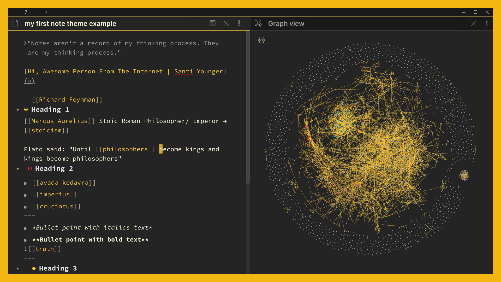
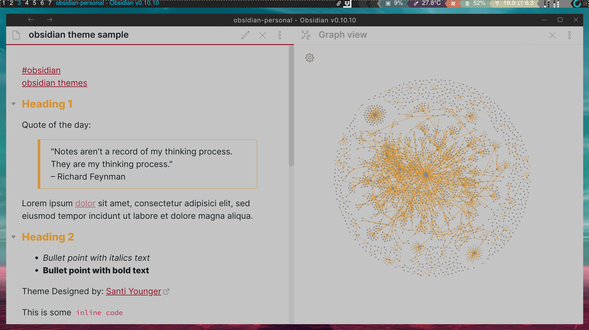

This theme is currently made for dark mode, light mode is not yet customized.

## Dark Mode

## Light Mode

## Installation

Wasp *is available in Obsidian Community Themes.*

In Obsidian go to Settings > Appearance > Community Themes > Browse

Search for: Wasp by Santi Younger

Click “Use”

If you get a window click “Overwrite”

Done, enjoy!

PS: If you are reading this from Obsidian, ignore the "Installation" instructions since you already know how to do it. It's probably too late now if you've already read this 👆 😂

