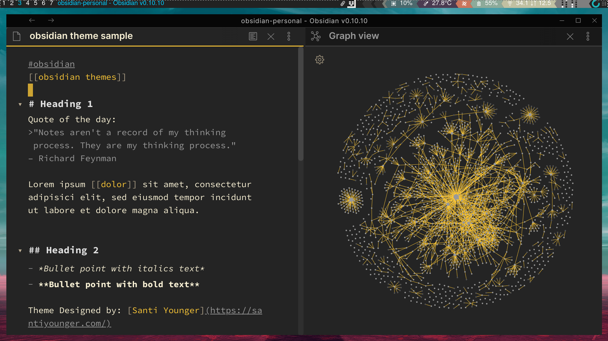
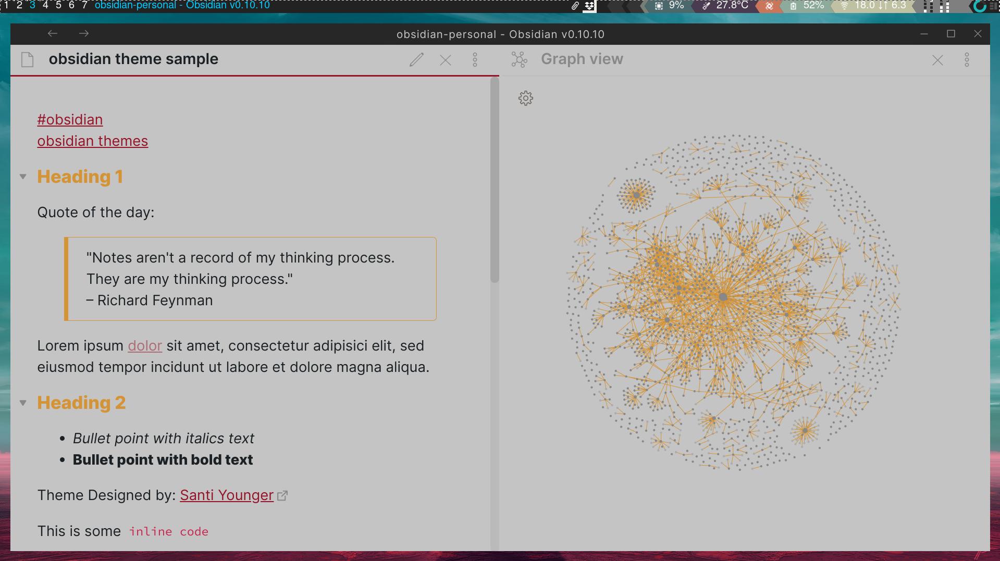

# Wasp

Wasp is a theme for [Obsidian](https://obsidian.md).

Wasp works in **dark mode** and **light mode**. You can switch between them anytime.

## Dark mode

Dark backgrounds with yellow accents.

## Light mode

Light cream backgrounds with amber accents.

**Wasp** by Santi Younger.

Wasp is free to use. If you like it, just leave a comment on one of my latest [YouTube videos](https://www.youtube.com/@SantiYounger/videos) saying you use Wasp, or [send me an email](https://www.santiyounger.com/contact).